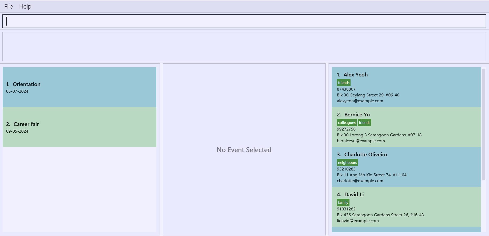

# Eventy User Guide

**Eventy** is a **desktop app that will help student leaders in NUS manage participants for event planning**  It will include various tags to help student leaders differentiate participants with fields such as dietary restrictions, type of participant, etc. as well as basic fields such as name and email.

<!-- * Table of Contents -->
<page-nav-print />

--------------------------------------------------------------------------------------------------------------------

## Quick start

1. Ensure you have Java `11` or above installed in your Computer.

2. Download the latest `eventy.jar` from [here](https://github.com/AY2324S2-CS2103T-T10-3/tp).

3. Copy the file to the folder you want to use as the _home folder_ for your AddressBook.

4. Open a command terminal, `cd` into the folder you put the jar file in, and use the `java -jar eventy.jar` command to run the application. 
   A GUI similar to the below should appear in a few seconds. Note how the app contains some sample data. 
   

5. Type the command in the command box and press Enter to execute it. e.g. typing **`help`** and pressing Enter will open the help window. 
   Some example commands you can try:

   * `addev -ev Orientation camp` : adds a new event with the name `Orientation camp`.

   * `addp n/John Doe p/98765432 e/johnd@example.com` : Adds a participant named `John Doe` to the main participant list.

   * `del 3` : Deletes the 3rd event shown in the current list.

6. Refer to the [Features](#features) below for details of each command.

--------------------------------------------------------------------------------------------------------------------
## Features

### Creating an event: `addev`

**Format:** `addev -ev <event name>`

**Description:**

Adds a new event with the specified name for the Event List.

**Caution:**

* `<event name>` should be **alphanumeric**, **non-empty** and **not longer than 64 characters**.
* Adding an event with a name that already exists, regardless of case, is **not allowed.**
  </box>

**Examples:**

- `addev -ev Orientation camp` adds a new event with the name `Orientation camp`.

### Deleting an event: `delev`

**Format:** `delev <index>`

**Description:**

Deletes an event and all its relevant information with its index in the event list.

**Caution:**
* `<index>` should be **numeric** and **non-empty**.

**Examples:**

- `delev 1` deletes the 1st event in the displayed list.

### Adding participant and their information to the global participant list: `addp`

**Format:** `addp -n <participant name> -p <phone number> -e <email>`

**Description:**

Adds a new participant to the app, allowing them to be added to an event later.

**Caution:**

* `<participant name>` should be **alphabetic**, **non-empty** and **not longer than 64 characters**.
* `<phone number>` should be **numeric**, **non-empty** and **not longer than 15 digits**.
* `<email>` should be **alphanumeric**, **non-empty** and **not longer than 64 characters**.
  </box>
  
**Examples:**

- `addp -n David -p 98987676 -e david@example.com` adds a participant named `David` 
with the phone number `98987676` and email of `david@example.com` to the displayed contacts list.

### Selecting an event: `sel`

**Format:** `sel <index>`

**Description:**

Selects an event with its index in the event list.

**Caution:**
* `<index>` should be **numeric** , **non-empty** and less than the number of events stored in the list.

**Examples:**

- `sel 1` selects the 1st event in the displayed list.

### Deselecting an event: `desel`

**Format:** `desel`

**Description:**

Deselects the event that has currently been selected.

**Caution:**
* This command is applicable only when an event has already been selected by command `sel`

**Examples:**

- `desel` deselects selected event and return to the event list.

--------------------------------------------------------------------------------------------------------------------

## FAQ

**Q**: How do I transfer my data to another Computer? 
**A**: Install the app in the other computer and overwrite the empty data file it creates with the file that contains the data of your previous AddressBook home folder.

--------------------------------------------------------------------------------------------------------------------

## Known issues

1. **When using multiple screens**, if you move the application to a secondary screen, and later switch to using only the primary screen, the GUI will open off-screen. The remedy is to delete the `preferences.json` file created by the application before running the application again.

--------------------------------------------------------------------------------------------------------------------

## Command summary

| Action                             | Format, Examples                                                                                                     |
|------------------------------------|----------------------------------------------------------------------------------------------------------------------|
| **Creating an event**              | `addev -ev <event name>`   e.g., `addev -ev orientation`                                                          |
| **Deleting an event**              | `delev INDEX`   e.g., `delev 1`                                                                                   |
| **Add participant to global list** | `addp -n <participant name> -p <phone number> -e <email>`  e.g., `addp -n David -p 98987676 -e david@example.com` |
| **Selecting an event**             | `sel INDEX`  e.g.,`sel 2`                                                                                         |
| **Deselecting an event**           | `desel`  e.g., `desel`                                                                                            |
                                                                                                                                                             |
